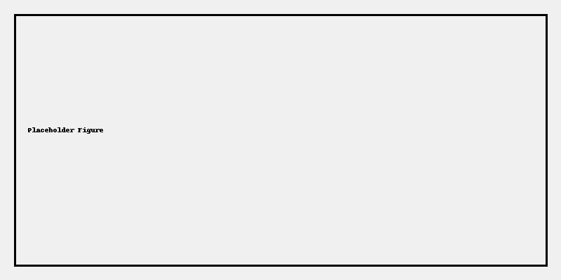

# Results

Attach notable figures/tables here with short captions. Place exported files in the folders below.

- `figures/` — PNG/SVG output from experiments
- `tables/` — CSV metrics (e.g., FID, LPIPS, optical-flow error, drift score)
- `reports/` — Generated markdown or HTML reports summarizing runs

Example figure embed (replace with a real file):

